# Hospital-Management-System

MySQL Database Project on Hospital management system, with features like handling COVID patients.
This desktop application is designed for Doctors and admin to handle patients and other staffs.

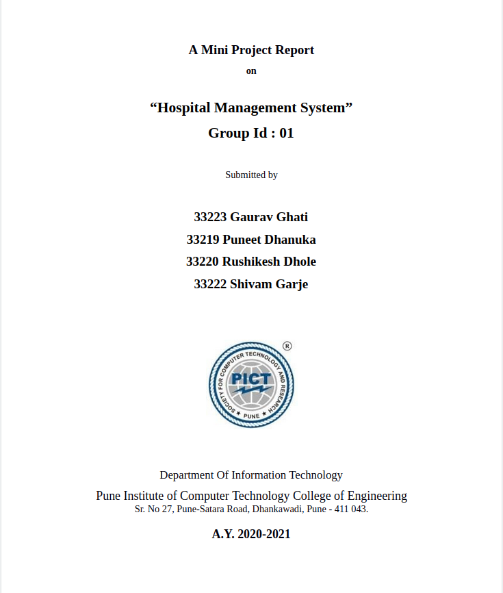

### ::::: ER Diagram of the Project ::::::
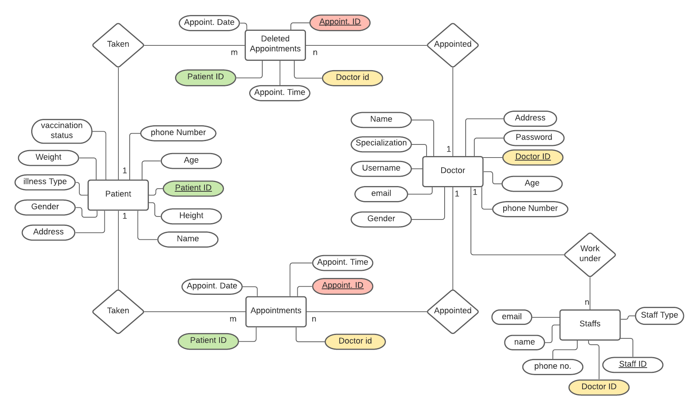

### ::::: Schema Diagram of the Project ::::::
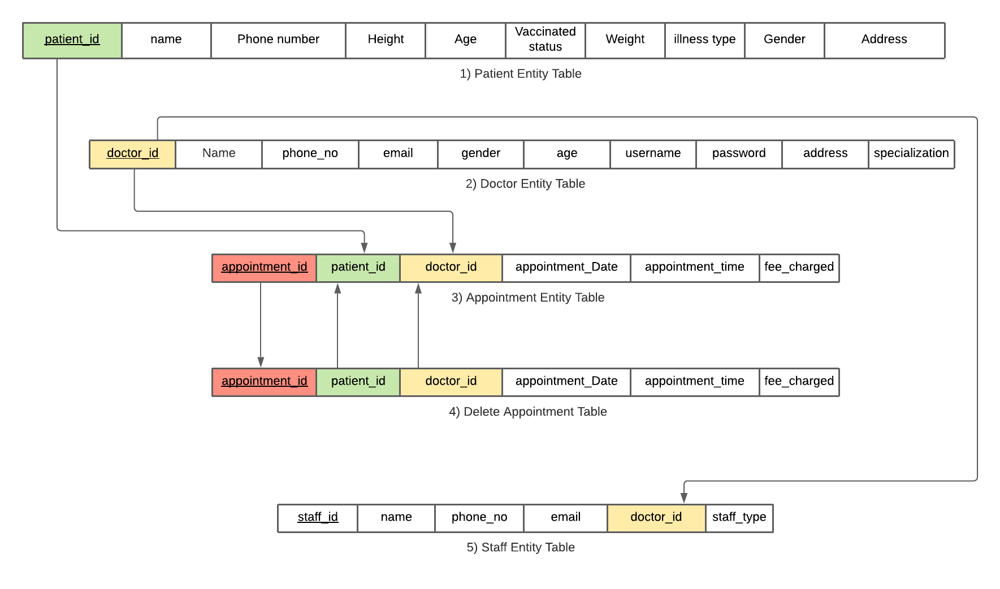

### ::::: Tables in Database ::::::
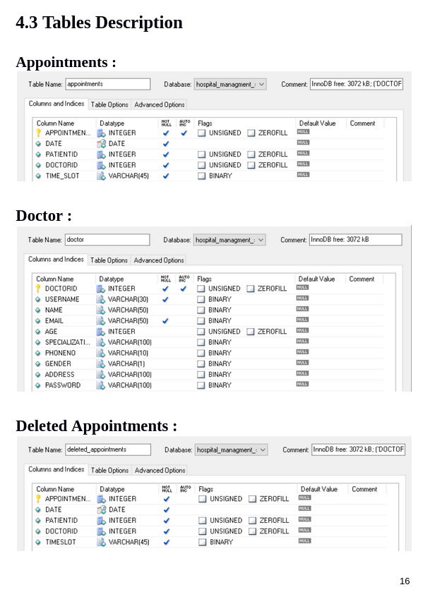

### ::::: Project Flow ::::::
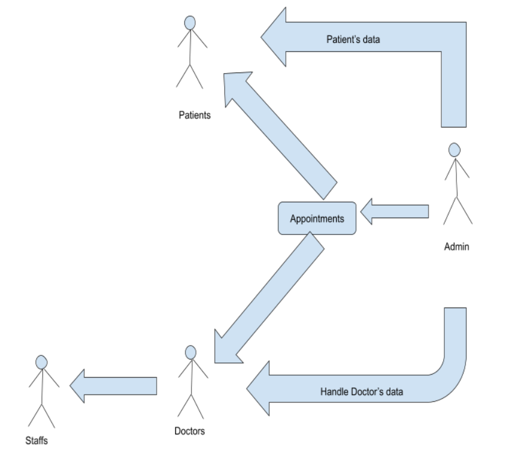

### ::::: User Interface ::::::
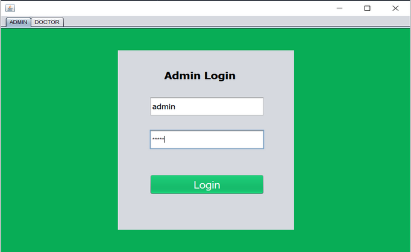
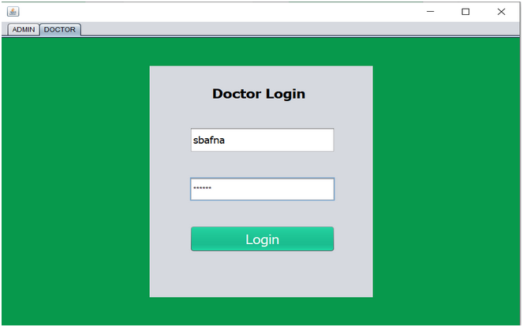
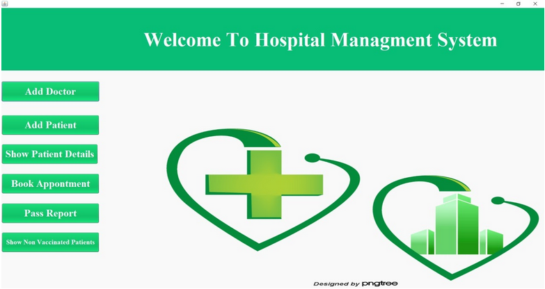
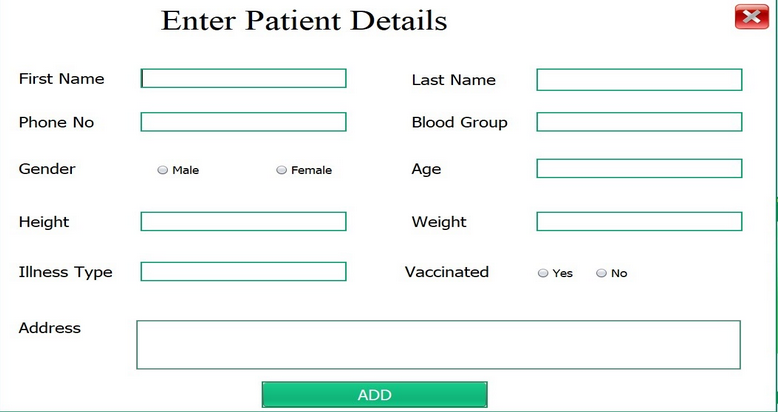
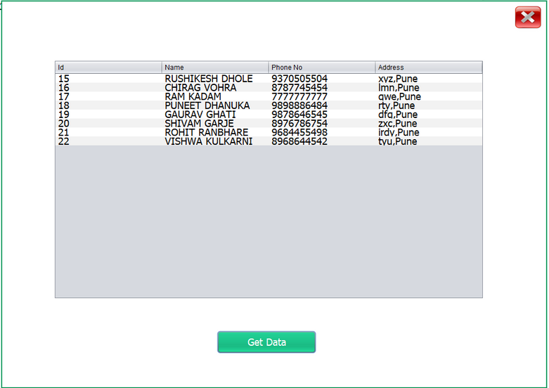
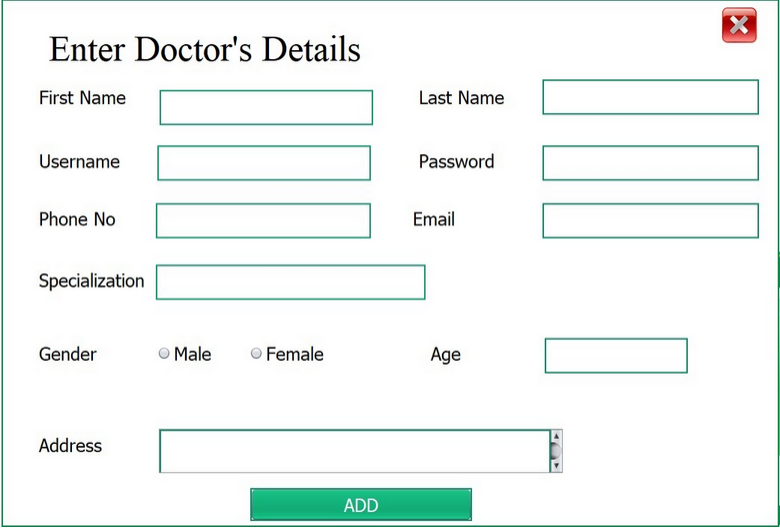
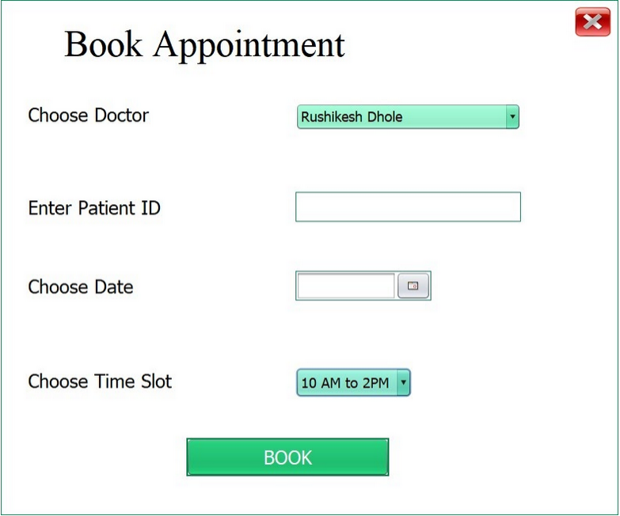
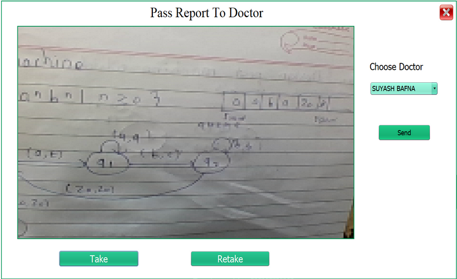
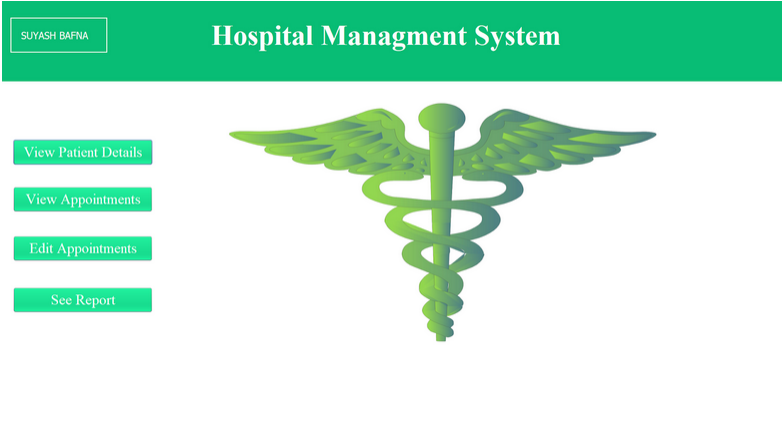
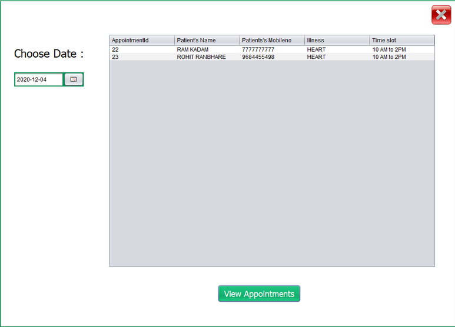
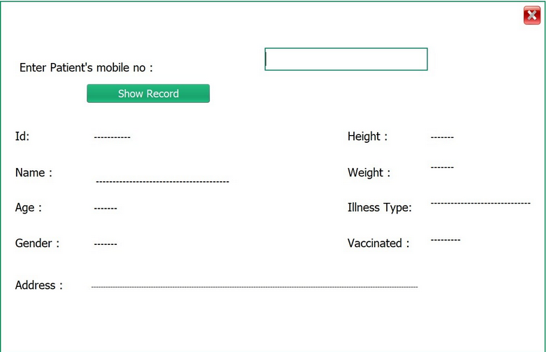
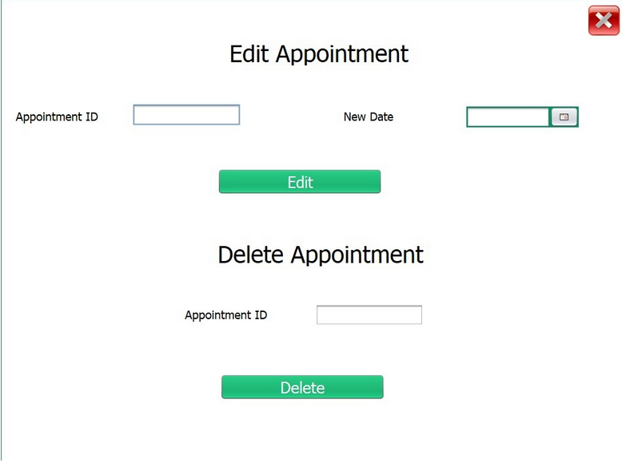

